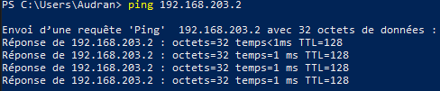
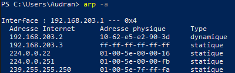
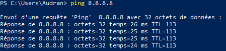
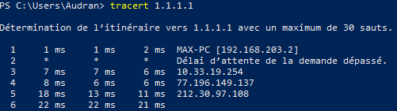
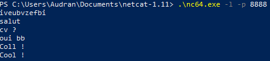
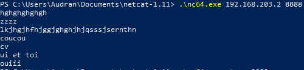
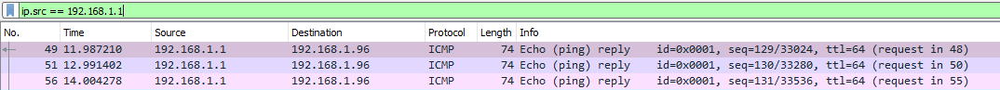
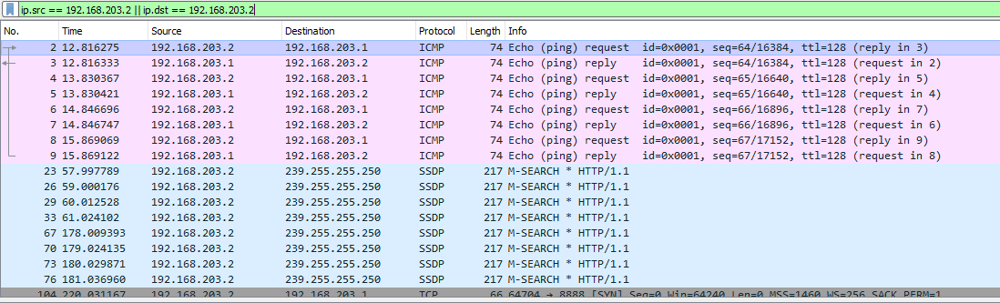
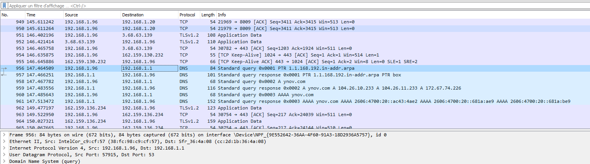

# TP1 Réseau
Le TP est réalisé sur le PowerShell Windows
## I : 1) Affichage d'informations sur la pile TCP/IP locale
 
Q1 : ipconfig 

            -> Carte réseau sans fil Wi-Fi / 38-FC-98-C9-CF-57 / 10.33.19.94
              
              -> Carte Ethernet Ethernet / D8-BB-C1-1F-04-67 / pas d'adresse IP

Q2 : ipconfig -> Passerelle par défaut. . . . . . . . . : 10.33.19.254

Q3 : Pour trouver les informations relatives à l'interface Wi-Fi :

Menu Démarrer > Paramètres > Réseau et internet > Etat > Afficher les propriétés du matériel et de la connexion

Q4 : La passerelle permet d'avoir accès à internet 
  

## I : 2) Modifications des informations
### A) Modification d'adresse IP (part 1)
 

Q1 : Pour changer d'adresse IP par l'interface graphique il faut aller dans  :

Panneau de configuration > Réseau et internet > Centre Réseau et partage > Modifier les paramètres de la carte > Clic droit sur Wifi > Propriétés > Clic sur Protocole internet version 4 (TCP/IPv4) > Clic sur propriétés > Clic sur utiliser l'adresse Ip suivante > 10.33.19.150

Q2 : On peut perdre son accès internet car l'adresse IP que l'on a rentré manuellement est peut-être déjà utilisée.
  

## II. Exploration locale en duo
## 3) Modification d'adresse IP
 
Q1: A la base l'adresse IP était 169.254.54.106. Après modification de la même manière que pour la question I-2)A), on voit avec un ipconfig /all que les modifications sont bien enregistrées.
  

Q2 : Ping de vérification

  

Q3 : Table ARP

  

## 4) Utilisation d'un des deux comme gateway
Mon Pc est celui à qui on a enlevé la connexion internet. J'ai alors mis l'adresse du deuxième poste en passerelle. Après le partage de la connexion du 2ème Pc, les pings sont envoyés :

Les tracert fonctionnent également et on peut voir que cela passe par la passerelle choisi à savoir le deuxième pc (MAX-PC [192.168.203.2]) :

  

## 5) Petit chat privé
Utilisation des commandes données dans le TP -> chat disponible entre les deux pc.

Coté Pc serveur :

Coté Pc client :

## 6) Firewall
Q1 : Pour autoriser les pings -> netsh advfirewall firewall add rule name="ICMP Allow incoming V4 echo request" protocol=icmpv4:8,any dir=in action=allow

Q2 : Pour autoriser le traffic sur le port qu'utilise nc -> Graphiquement : On se dirige dans :

"Pare-feu Windows Defender avec fonctions avancées de sécurité" > Nouvelle règle > port > TCP et port 8888 > Autoriser la connexion > suivant > suivant.
  

## III. Manipulations d'autres outils/protocoles côté client
## 1) DHCP
 
Q1 : ipconfig /all -> 10.33.19.254

Q2 : Avec la même commande, on obtient également la date de début du bail :

(Bail obtenu. . . . . . . . . . . . . . : mercredi 28 septembre 2022 08:57:29) 

et la date de fin :

(Bail expirant. . . . . . . . . . . . . : jeudi 29 septembre 2022 08:57:29)
  

## 2) DNS
 
Q1 : ipconfig /all -> (Dans Carte réseau sans fil Wi-fi)    Serveurs DNS. . .  . . . . . . . . . . : 8.8.8.8
                                       8.8.4.4
                                       1.1.1.1
  
Q2 : Pour le look up de google :

nslookup google.com -> Address:   216.58.215.46
  
Pour le look up de ynov :

nslookup ynov.com ->           104.26.11.233
          104.26.10.233
          172.67.74.226

 
Q3 : Les noms de domaines google.com et ynov.com ont donc pour adresse ip 216.58.215.46 et 104.26.11.233.
  

Q4 : Etant donné que c'est le serveur DNS qui permet de faire ce que l'on a fait précédemment, l'adresse IP du serveur à qui ont vient de demander d'effectuer ces requêtes est 8.8.8.8
  

Q5 : nslookup 78.74.21.21 -> host-78-74-21-21.homerun.telia.com

nslookup 92.146.54.88 -> dns.google ne parvient pas à trouver 92.146.54.88 : Non-existent domain
  

Q6 : La première adresse Ip appartient au nom de domaine "host-78-74-21-21.homerun.telia.com" tandis que la deuxième n'est pas attribuée.
  

## IV - Wireshark
(Cette partie du tp a été faite chez moi, d'où les adresses IP différentes sauf pour la question 2)
1) Ping entre vous et la passerelle :

  
2) Un netcat entre vous et votre mate, branché en RJ45 :

  
3) Une requête DNS :

Le serveur DNS en question correspond à l'adresse IP 192.168.1.1 qui varie entre source et destination.

